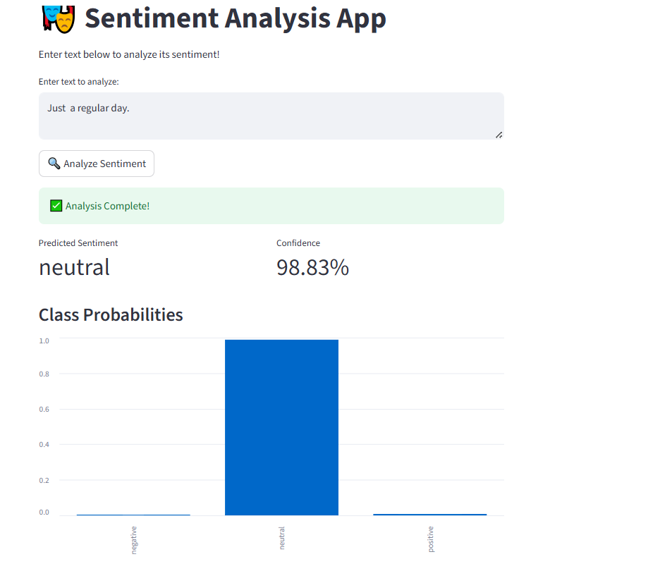
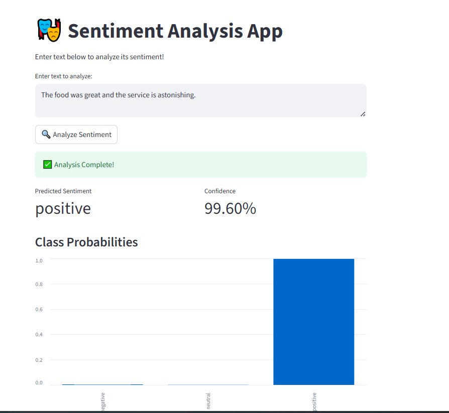

# BERT Sentiment Analysis App

🎭 A Streamlit web application for **sentiment analysis** using a fine-tuned BERT model.  
Users can input text and get a **predicted sentiment**, **confidence score**, and **class probabilities**.

---

## 🚀 Features

- Analyze text sentiment in **real-time**.
- Displays **predicted sentiment** and **confidence score**.
- Shows **class probabilities** in a bar chart.
- Includes **example sentences** for quick testing.
- Automatically downloads:
  - **BERT model** from Google Drive.
  - **Label encoder** from GitHub.
- Fully **cache-optimized** for fast predictions.

---

## 📁 Project Structure

```
BERT_Sentiment_Analysis/
│
├─ app.py                 # Streamlit app
├─ model.py               # SentimentClassifier definition
├─ inference.py           # Model inference logic
├─ label_encoder.pkl      # Label encoder for sentiment classes
├─ requirements.txt       # Dependencies
├─ sentiment_analysis.csv # Sample sentiment analysis data
├─ train_validate.py      # Script for training and validation
├─ negative.PNG           # Example negative sentiment
├─ neutral.PNG            # Example neutral sentiment
├─ positive.PNG           # Example positive sentiment
└─ .devcontainer/         # Development container configuration
```

---

## 📸 Example Predictions

### Negative Sentiment


### Neutral Sentiment


### Positive Sentiment


> The screenshots show how the app displays predictions and probability charts.

---

## ⚡ Installation & Run Locally

1. **Clone the repository:**

```bash
git clone https://github.com/KirollosRafat/BERT_Sentiment_Analysis.git
cd BERT_Sentiment_Analysis
```

2. **Install dependencies:**

```bash
pip install -r requirements.txt
```

3. **Run the app:**

```bash
streamlit run app.py
```

4. Open the URL displayed in your browser (usually `http://localhost:8501`).

> Note: The first run will download the **BERT model (~400MB)** from Google Drive.

---

## ☁️ Deployment on Streamlit Cloud

1. Push your repository to GitHub.
2. Go to Streamlit Community Cloud and click **New App**.
3. Connect your GitHub repository.
4. Select the main file (`app.py`) and branch, then click **Deploy**.
5. The app will automatically fetch the model and label encoder.

---

## 📝 Usage

1. Enter text in the text area.
2. Click **“Analyze Sentiment”**.
3. View:
   - **Predicted sentiment**
   - **Confidence**
   - **Class probabilities**
4. Click example buttons to quickly test predefined sentences.


## 🔗 App Link
I hope you take a look and try with simple texts.
LINK: https://bertsentimentanalysis-j6j4tvgtjvsmlnh8ksahhd.streamlit.app
